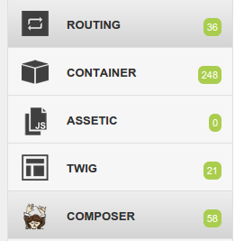

Elao WebProfilerExtraBundle
============

## What is this Symfony2 bundle for ?

It adds in your WebProfiler extra sections :

+ **Routing** : Lists all the routes connected to your application
+ **Container** : Lists all the services available in your container
+ **Twig** : Lists Twig extensions, tests, filters and functions available for your application
+ **Assetic**

## Installation

#### If you are working with Symfony >= 2.2

Add this in your `composer.json`

    "require-dev": {
        [...]
        "elao/web-profiler-extra-bundle" : "dev-master"
    },

And run `php composer.phar update elao/web-profiler-extra-bundle`

If you are working with Symfony <= 2.1, prefer the 2.1 branch of this bundle `"elao/web-profiler-extra-bundle" : "dev-2.1"`

#### If you are (still) working with Symfony 2.0.x

Add the followings lines to your `deps` file

    [ElaoWebProfilerExtraBundle]
        git=https://github.com/Elao/WebProfilerExtraBundle.git
        target=bundles/Elao/WebProfilerExtraBundle

and don't forget to register it in your autoloading `app/autoload.php`

    $loader->registerNamespaces(array(
        [...]
        'Elao' => __DIR__.'/../vendor/bundles',
    ));

#### Register the bundle in your AppKernel (`app/AppKernel.php`)

Most of the time, we need this bundle to be only activated in the `dev` environement

    [...]
    if (in_array($this->getEnvironment(), array('dev', 'test'))) {
        [...]
        $bundles[] = new Elao\WebProfilerExtraBundle\WebProfilerExtraBundle();
    }

#### Activate the different collectors in  `app/config/config_dev.yml`

    web_profiler_extra:
        routing:
            enabled:        true
            display_in_wdt: true
        container:
            enabled:        true
            display_in_wdt: true
        assetic:
            enabled:        true
            display_in_wdt: true
        twig:
            enabled:        true
            display_in_wdt: true

## Install assets

Install assets by running to have beatuiful icons in your debug bar

    $ app/console assets:install web/ --symlink

## Screenshot

